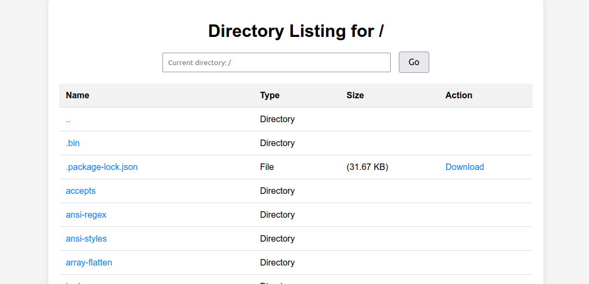

# OpenDir Express

OpenDir Express is a simple Node.js application that uses Express to serve files from a directory and provides a RESTful API to list directory contents. The application allows downloading files and viewing directory structures.



## Features

- Serve static files from a specified directory
- List directory contents with file details
- Download files directly from the server
- Configurable server IP and port

## Requirements

- Node.js
- npm (Node Package Manager)

## Installation

1. Clone the repository or download the source code.
2. Navigate to the project directory.
3. Install the dependencies:

    ```bash
    npm install
    ```

## Usage

To start the server, run the following command:

```bash
node src/index.js
```

By default, the server runs on port `3000` and binds to the local IP address. You can configure the server port and IP address using command-line options.


Command-line Options
```
─➤  node src/index.js -h                                 
Options:
    --version        Show version number                             
    -p, --port           Port to run the server on        [default: 3000]
        --ip_addr, --ip  IP address            
    -h, --help           Show help                                       
```

## Example:

```bash
node src/index.js --port 4000 --ip_addr 192.168.1.10
```

To see the help message with all available options, run:

```bash
node src/index.js -h
```

## Project Structure

```
src/index.js: Main server code.
package.json: Project metadata and dependencies.
public/: Directory for serving static files.
```

